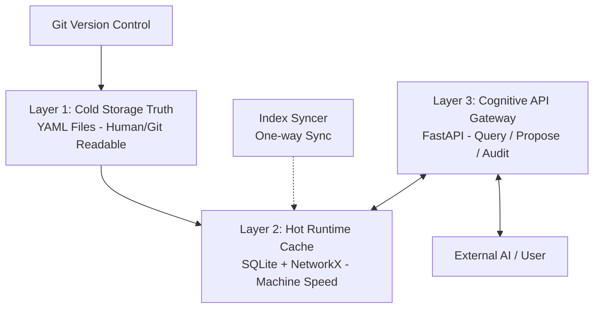

这份文档是 **SpecIndex 项目的最终架构蓝图（v3.2）**。

它严格限定在 **“软件产品知识管理系统”** 的基础设施设计范畴，剥离了具体的 AI 任务执行逻辑，专注于数据的**存储、结构定义、API 协议与一致性维护**。

---

# 📘 SpecIndex 系统架构设计规范
**Version**: 3.2 (Infrastructure Final)
**Type**: Infrastructure Design Document (IDD)
**Scope**: 核心知识库系统（不包含 AI Agent 执行逻辑）

---

## 1. 系统定义 (System Definition)

**SpecIndex** 是一个面向 AI 原生（AI-Native）开发模式的 **“无头语义数据库（Headless Semantic Database）”**。

### 1.1 核心价值
它作为软件产品的 **“可信事实源（Single Source of Truth）”**，解决无状态 AI 开发中的以下核心问题：
*   **记忆外挂**：为无状态的 AI 瞬时构建精准的上下文。
*   **逻辑一致性**：通过结构化契约，防止文档与代码逻辑脱节。
*   **分支跟随**：知识库状态与 Git 代码分支严格同步，支持“时间旅行”。

### 1.2 系统边界 (Scope Boundary)

*   **✅ IN SCOPE (本设计包含)**：
    *   数据存储架构 (YAML + SQLite)。
    *   元数据模型定义 (Schema)。
    *   知识图谱拓扑逻辑与算法。
    *   读写 API (Query & Proposal)。
    *   数据一致性校验 (Auditor)。
*   **❌ OUT OF SCOPE (本设计不包含)**：
    *   任务调度与工作量评估。
    *   AI 代码生成与具体实现。
    *   IDE 插件或图形化界面 (UI)。

---

## 2. 核心架构：Git 原生双模态 (Dual-Modal Architecture)

系统采用 **“文件即真理，数据库即缓存”** 的双层存储策略。

### 2.1 架构图示


### 2.2 存储层设计

#### A. 持久层 (Cold Storage) - 提交到 Git
目录结构设计如下，确保人类可读且对 Git 友好：

```text
/project_root
  ├── .spec_index/
  │   ├── config.yaml           # 全局配置 (Domain列表, 忽略规则)
  │   ├── schema/               # Pydantic Schema (用于校验 YAML 合法性)
  │   │
  │   ├── substrate/            # 【基质层】全局规范 (水平切面)
  │   │   ├── logging.yaml      # 日志规范
  │   │   ├── security.yaml     # 安全规范
  │   │   └── error.yaml        # 错误码规范
  │   │
  │   └── features/             # 【业务层】原子特性 (垂直业务)
  │       ├── UserDomain/       # 按领域物理分文件夹
  │       │   ├── feat_login.yaml
  │       │   └── feat_profile.yaml
  │       └── OrderDomain/
  │           └── feat_create.yaml
```

#### B. 运行时层 (Hot Runtime) - `.gitignore`
这是系统启动时自动生成的衍生品，提供 ms 级查询响应：

```text
/project_root
  ├── .spec_index/
  │   ├── .cache/               # 必须加入 .gitignore
  │   │   ├── index.db          # SQLite (存节点、边、全文索引)
  │   │   └── graph.obj         # NetworkX 序列化对象 (用于复杂路径计算)
```

---

## 3. 数据模型定义 (Data Model)

### 3.1 核心实体：原子特性 (Atomic Feature)
对应 `features/**/*.yaml` 中的每个文件。这是图谱的基本单元。

```yaml
# 示例：feat_user_login.yaml
meta:
  id: "feat_user_login"       # 全局唯一 ID
  type: "FEATURE"
  domain: "UserDomain"
  status: "IMPLEMENTED"       # DRAFT | PROPOSED | IMPLEMENTED

intent:
  summary: "用户通过手机号和验证码登录"
  # 语义向量将基于此字段生成，存入 SQLite

contract: # 核心契约
  input: 
    phone: "String(MobileCN)"
    code: "String(Len=6)"
  output: 
    token: "String(JWT)"
  side_effects:               # 关键：显式声明副作用
    - "DB_WRITE: users"
    - "API_CALL: sms_service"

dependencies: # 图谱连接
  - target: "feat_sms_verify"
    type: "HARD_LINK"         # HARD_LINK (调用) | SOFT_LINK (关联)
    reason: "校验验证码"

assets: # 物理映射
  docs: ["docs/login.md"]
  code_signatures:            # 由 Syncer 自动扫描代码填充，不建议人工维护
    - file: "src/auth.py"
      func: "login_handler"
```

### 3.2 辅助实体：基质 (Substrate)
对应 `substrate/*.yaml`。不作为图谱节点，而是作为 **"环境上下文 (Ambient Context)"**。
*   **作用**：定义全系统的“宪法”，如日志格式、鉴权标准。
*   **注入规则**：基于 Domain 或 Tags 自动注入 Prompt。

---

## 4. 核心组件与机制 (Core Mechanisms)

### 4.1 Index Syncer (海马体同步器)
**职责**：负责将 YAML 数据加载到 SQLite，并维护代码签名的一致性。
**触发时机**：系统启动、Git 分支切换 (Post-checkout hook)、提案批准后。

**工作流**：
1.  **Purge**：清空 `.cache/index.db`。
2.  **Load**：遍历 YAML，校验 Schema，写入 `nodes` 和 `edges` 表。
3.  **Scan**：调用 **Tree-sitter** 解析器，扫描项目源码。
    *   提取所有 Public Function 的签名。
    *   更新 `index.db` 中的 `code_signatures` 表。
4.  **Vectorize** (可选)：对 `intent.summary` 进行 Embedding，存入向量字段。

### 4.2 提案-审核协议 (Proposal-Review Protocol)
**职责**：管理对知识库的“写”操作。**AI 禁止直接修改 YAML 文件**。

**工作流**：
1.  **Propose**：外部 Agent 调用 API 提交变更请求。
2.  **Diff**：系统生成内存中的 YAML 对象，对比当前文件，生成 Diff。
3.  **Gatekeep**：系统暂停，等待 API 返回（或人类确认）。
4.  **Commit**：批准后，系统使用 `PyYAML` 将变更**回写**到磁盘上的 YAML 文件。
5.  **Re-Sync**：触发局部 Index Syncer，更新缓存。

---

## 5. API 接口定义 (API Reference)

API 是本系统的唯一对外界面。

### 5.1 Query API (构建上下文)

```typescript
/**
 * 核心接口：获取“关注气泡”
 * 根据当前任务，返回最小且充分的知识切片
 */
GET /context/bubble
Params:
  - focus_node_id: string (可选，如 "feat_login")
  - query: string (可选，如 "修改登录逻辑")
Returns:
  - target_feature: Object (当前功能的完整定义)
  - dependencies: List (直接依赖的接口签名，不含实现)
  - substrate: List (相关的基质规范，如 Logging 规范)
  - related_docs: List (关联文档路径)

/**
 * 语义搜索
 */
GET /context/search
Params:
  - q: string
Returns:
  - nodes: List<NodeMetadata>
```

### 5.2 Mutation API (变更提案)

```typescript
/**
 * 提案：创建/更新特性
 */
POST /proposal/feature
Body:
  - domain: string
  - name: string
  - intent: string
  - contract: Object
Returns:
  - proposal_id: string
  - diff_preview: string

/**
 * 提案：添加依赖关系
 */
POST /proposal/dependency
Body:
  - source_id: string
  - target_id: string
  - type: "HARD" | "SOFT"
```

### 5.3 Audit API (一致性校验)

```typescript
/**
 * 校验代码与图谱的一致性
 * 用于 CI/CD 或 代码提交前检查
 */
POST /audit/verify
Body:
  - changed_files: List<string>
Returns:
  - violations: List<{
      severity: "ERROR" | "WARN",
      msg: "Code calls 'PaymentService' but dependency not declared in SpecIndex."
    }>
```

---

## 6. 数据库设计 (Runtime Schema - SQLite)

虽然数据源是 YAML，但在 SQLite 中我们需要关系模型来加速查询。

**Table: `nodes`**
*   `id` (PK, TEXT): feat_user_login
*   `type` (TEXT): FEATURE / SUBSTRATE
*   `domain` (TEXT): UserDomain
*   `content_blob` (JSON): YAML 的完整内容副本
*   `embedding` (BLOB): 向量数据

**Table: `edges`**
*   `source_id` (FK)
*   `target_id` (FK)
*   `type` (TEXT): HARD_LINK / SOFT_LINK

**Table: `signatures` (代码影子)**
*   `node_id` (FK)
*   `file_path` (TEXT)
*   `func_name` (TEXT)
*   `signature_hash` (TEXT): 用于快速检测代码变更

---

## 7. 技术栈推荐 (Implementation Stack)

为了实现轻量级、无依赖、易维护：

*   **核心语言**: **Python 3.10+**
*   **Web 框架**: **FastAPI** (高性能 API 服务)
*   **数据校验**: **Pydantic V2** (定义 YAML Schema 和 API Model)
*   **文件处理**: **PyYAML** (读写 YAML)
*   **数据库 ORM**: **SQLModel** (结合 Pydantic 和 SQLAlchemy，完美适配 SQLite)
*   **代码解析**: **Tree-sitter** (Python binding，用于提取代码签名)
*   **图计算**: **NetworkX** (用于依赖分析)

---

### 架构师结语

这份文档完整定义了 **SpecIndex** 的物理形态和交互规则。

*   它**不是**一个简单的文档文件夹，因为它有数据库索引和 API 网关。
*   它**不是**一个黑盒数据库，因为它的核心存储是 Git 管理的 YAML 文件。

这套设计完美实现了**“数据与代码同源”**，是支撑超级个体进行无状态 AI 开发的最稳固基石。